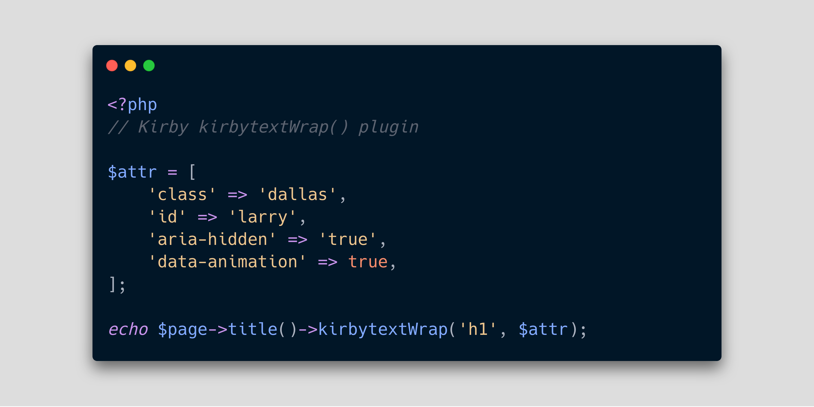

# KirbytextWrap plugin for Kirby

   

Kirby Plugin to remove or replace the `<p> </p>` enclosing tag and set HTML attributes. This will keep your kirbytag working.  
Support both Kirby 2 and Kirby 3 version!

---



## How it works?

In your template, `$page->title()->kirbytextWrap()` will give you the same as kirbytext() without the `<p>` enclosing tag. This work also with the short `ktw()` alias.

### Do much more

`$page->title()->kirbytextWrap('h1')` Will replace the `<p>` enclosing tag by `<h1>`.  
`$page->title()->kirbytextWrap('h1', ['class' => 'title'])` Will replace the `<p>` enclosing tag by `<h1>` and add a class attribute with its value.

Put as many attributes as you want, you better create a variable for your array of attributes.

```php
<?php
$attr = [
    'class' => 'dallas',
    'id' => 'larry',
    'aria-hidden' => 'true',
    'data-animation' => true,
];

echo $page->title()->kirbytextWrap('p', $attr);
```

## Yeah cool but how to install?

You can install the kirbytextWrap plugin manually, with CLI, through Git submodule or with Composer.

-   Manually:  
     Just download your desired version through the [releases page](https://github.com/yoanmalie/kirbytextwrap/releases), unzip and place the given folder into the `site/plugin` directory and rename it to `kirbytextWrap`.

-   Kirby CLI:

    ```bash
    kirby plugin:install yoanmalie/kirbytextwrap
    ```

    ⚠️ This will just work for Kirby 2 has CLI was removed on Kirby 3.

-   Git submodule:
    ```bash
    git submodule add https://github.com/yoanmalie/kirbytextwrap site/plugins/kirbytextWrap
    git submodule update --init --recursive
    ```
-   Composer:
    ```bash
    composer require yoanmalie/kirbytextwrap
    ```

## Credits

🤚 High five to [@judbd](https://github.com/judbd) who give me this plugin idea.  
🎩 Hat tip to Jannik with his [kirbytextRaw](https://github.com/jbeyerstedt/kirby-plugin-kirbytextRaw) plugin who helped me when started to develop this plugin!
